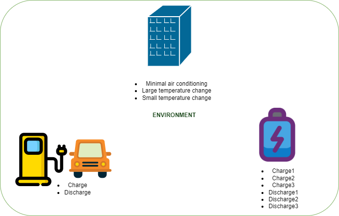

# MultiAgent System

This repository provides a platform that combines deep learning and deep reinforced learning for the active management of an electrical grid, using components such as batteries or charging stations for electric vehicles with V2G solutions.

<p align="center">
  
</p>

The main objective is the anticipation of optimal decision making to maintain a flexibility or consumption pattern. Therefore, two trained models are available for the prediction of the next hour's consumption in quarter-hourly intervals. This prediction generated from several neural network models will be the input of the multi-agent system.

Once the system has been defined, a DQN agent model will be used to solve it and thus obtain the set of actions that satisfy the consumption pattern indicated by the user. In case no solution is found, all the actions it has performed until the moment when the selected requirements are not met will be listed.

## Installation:
```
pip install -r Code/requirements.txt
```

## Execution 

```
python mas.py
```
